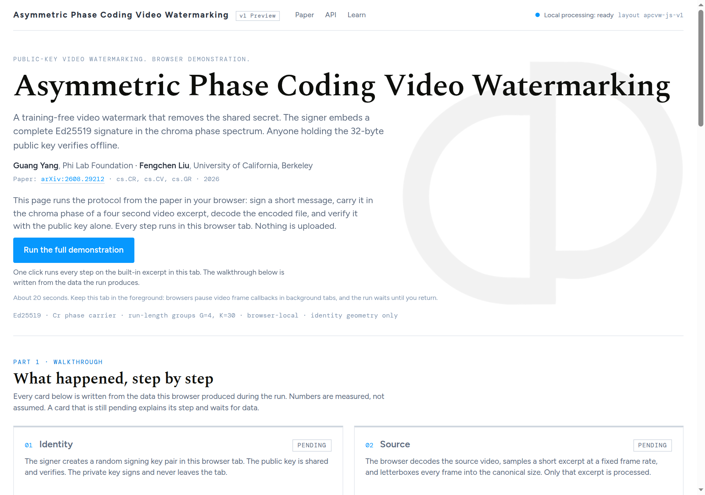
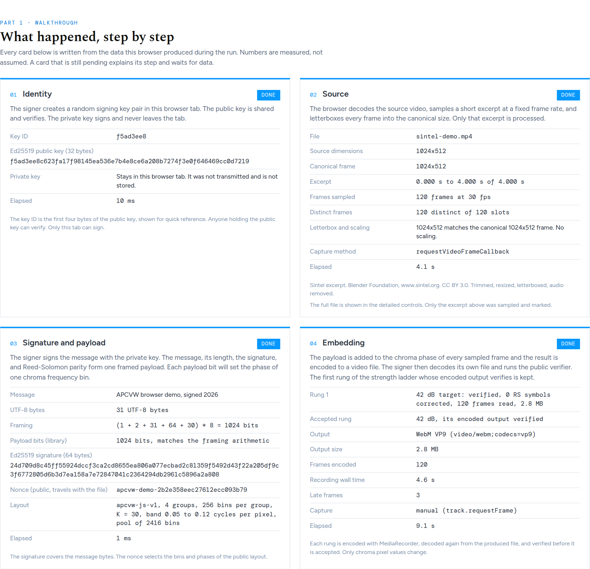
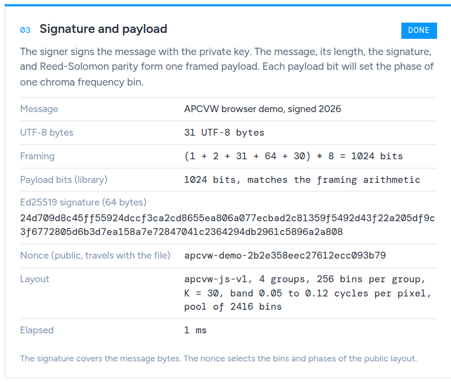
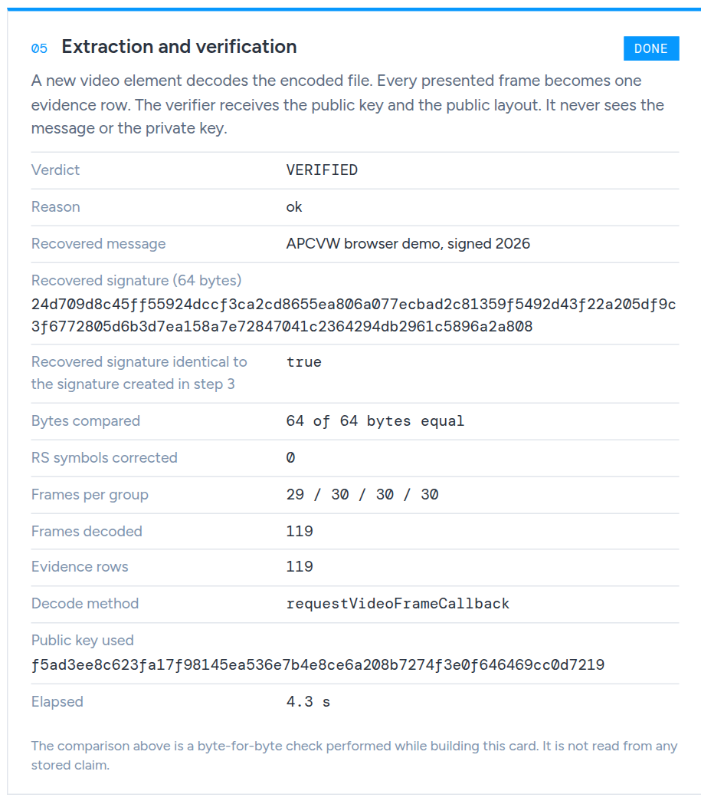
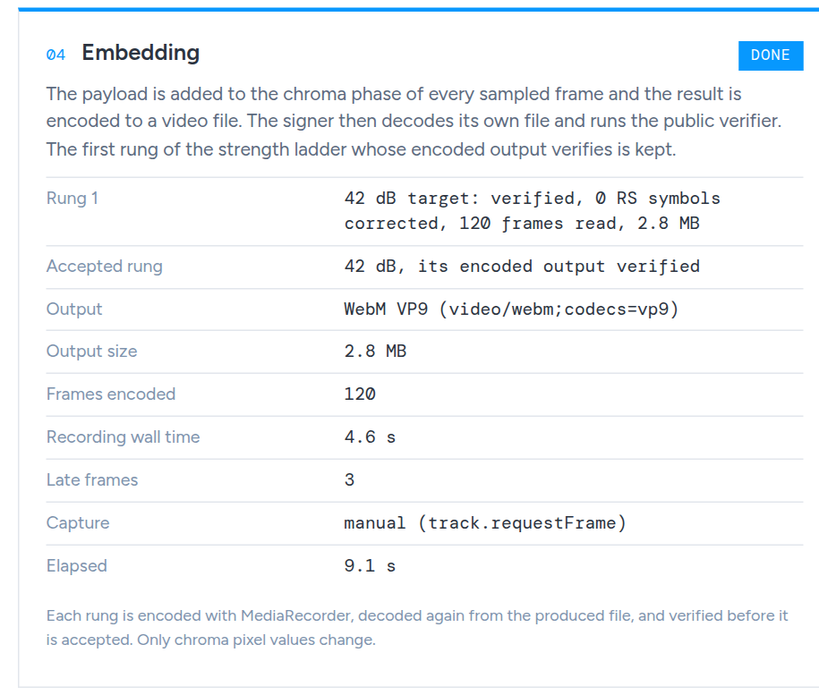
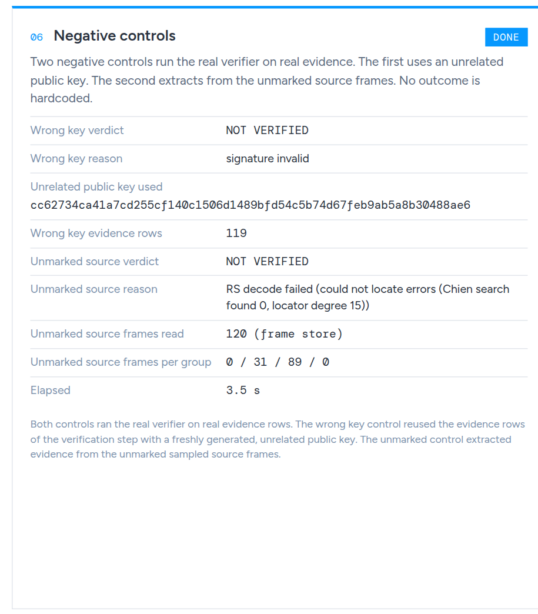
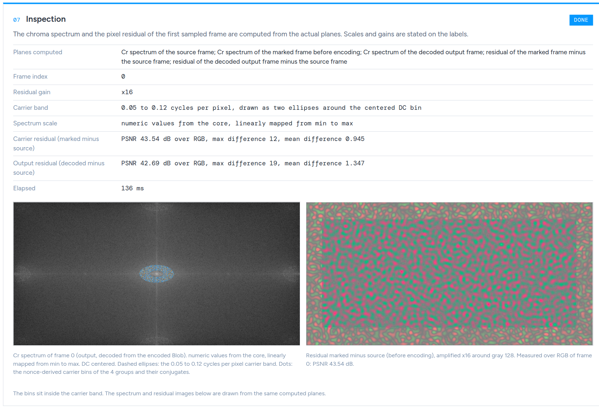
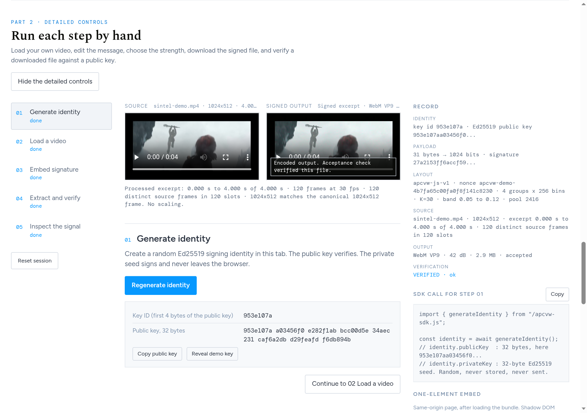

# Asymmetric Phase Coding Video Watermarking

**A training-free video watermark that removes the shared secret.** The signer embeds a complete Ed25519 signature in the phase spectrum of the chroma plane. Anyone holding the 32-byte public key verifies offline: no model, no registry, no network, no shared secret.

This repository contains `apcvw-js`, a browser-local JavaScript implementation of the protocol, and the interactive demonstration that runs it. Everything executes in the browser tab. Nothing is uploaded.

[**Paper: arXiv:2608.29212**](https://arxiv.org/abs/2608.29212) · [PDF in this repository](public/paper/apcvw.pdf) · [Project page at Phi Lab Foundation](https://philab.fund/Researches/Asymmetric-Phase-Coding-Video-Watermarking) · [Live demonstration](https://philab.fund/APCVW/)

**Authors:** Guang Yang (Phi Lab Foundation) and Fengchen Liu (University of California, Berkeley).



## Contents

1. [Why asymmetric](#why-asymmetric)
2. [How it works](#how-it-works)
3. [Quick start: the demonstration](#quick-start-the-demonstration)
4. [Quick start: the library](#quick-start-the-library)
5. [One line on your own page](#one-line-on-your-own-page)
6. [API overview](#api-overview)
7. [What the browser version does and does not do](#what-the-browser-version-does-and-does-not-do)
8. [Repository layout](#repository-layout)
9. [Development and tests](#development-and-tests)
10. [Citation](#citation)
11. [License](#license)

## Why asymmetric

Existing video watermarking systems are symmetric. The party that can verify a mark holds the extractor weights or the generator secret, and can therefore also embed one. Benchmarks confirm the consequence: white-box forgery defeats every evaluated method.

Here the roles are separated by public-key cryptography. The signer holds an Ed25519 private key and embeds a signature. A verifier needs only the public key and a few bytes of public per-video metadata (a nonce, the frame size, the message length). The verifier cannot produce a valid mark, because producing one requires the private key.

On 1000 uncurated real-world clips, the reference implementation described in the paper ships a verifying signature for 99.3% of the corpus and accepts a wrong public key zero times in 1000 attempts. An attack-aware acceptance gate yields embeddings that survive H.264 re-encoding at 100% and 50% rescaling at 97.4% on gated clips. Those numbers were measured with the Python reference implementation and H.264. The browser build in this repository reports only what it measures on the file in front of it; see [scope](#what-the-browser-version-does-and-does-not-do).

## How it works

### 1. Payload

The signer signs the message bytes $m$ with the Ed25519 private key and frames the result as one Reed-Solomon codeword:

$$
\text{body} = \underbrace{0x00}_{\text{flag}} \,\|\, \underbrace{\text{len}(m)}_{2\ \text{bytes}} \,\|\, m \,\|\, \underbrace{\sigma}_{64\ \text{bytes}}, \qquad
\text{coded} = \text{body} \,\|\, \text{RS}_{30}(\text{body})
$$

The bit count is therefore $B = (1 + 2 + |m| + 64 + 30) \times 8$. A 31-byte message gives $B = 1024$ bits. The RS code over $\mathrm{GF}(2^8)$ corrects up to 15 symbol errors. The message may be 1 to 158 UTF-8 bytes.

### 2. Public layout

A public nonce $n$ seeds a deterministic layout. From the mid-band bins of the frame's 2-D spectrum,

$$
\mathcal{P} = \left\{ (k_y, k_x) : 0.05 \le \sqrt{\left(\tfrac{k_y}{H/2}\right)^2 + \left(\tfrac{k_x}{W/2}\right)^2} < 0.12 \right\},
$$

the layout draws $B$ distinct bins and one phase $\phi_j \in [0, 2\pi)$ per bin, then splits them into $G = 4$ groups of $B/4$ bins. For a 1024 by 512 frame the pool has 2416 bins. The layout contains geometry only; it carries no payload material, so it can be published with the video.

### 3. Carrier and embedding

For group $g$ the carrier plane is a sum of cosines, one per bin, with the sign chosen by the payload bit:

$$
c_g(x, y) = \sum_{j \in g} s_j \,\alpha \cos\!\left( 2\pi \left( \tfrac{k_{y,j}\, y}{H} + \tfrac{k_{x,j}\, x}{W} \right) + \phi_j \right), \qquad s_j = 2 b_j - 1 .
$$

The amplitude follows from a target PSNR $P$ in decibels for the Cr plane:

$$
\alpha = \sqrt{ \frac{2 \cdot 255^2}{10^{P/10} \cdot |g|} } .
$$

The plane is added to the Cr chroma channel of every frame; luma and Cb change only through the final 8-bit rounding. Frames are assigned to groups in runs of $K = 30$: frame $t$ carries group $\lfloor t / 30 \rfloor \bmod 4$.

### 4. Extraction and verification

The verifier never reads a frame index. For each received frame it takes the 2-D FFT of the Cr plane and, for every bin of every group, rotates the coefficient by the layout phase:

$$
C_j = F[k_{y,j}, k_{x,j}] \, e^{-i \phi_j}, \qquad
\text{score}_g = \frac{\sum_{j \in g} \operatorname{Re}(C_j)^2}{\sum_{j \in g} \operatorname{Im}(C_j)^2} .
$$

The group with the highest score is the frame's group; a mode filter over 30 frames smooths the assignment. Real parts are whitened by the local host energy around each bin and accumulated per payload bit. A hard decision gives the bits, RS decoding corrects errors, and Ed25519 verifies the recovered signature over the recovered message under the given public key. The output is either `VERIFIED` with the recovered message, or `NOT VERIFIED` with a reason.

### 5. Closed-loop signing

The signer encodes the marked frames to a real video file, decodes that file again, and runs the public verifier on it. It tries a ladder of strengths (42, 40, 38, 36, 34, 32 dB) and ships the first one whose encoded output verifies. Every released file has passed the same verifier the public uses.

## Quick start: the demonstration

Open the [live demonstration](https://philab.fund/APCVW/) or run it locally:

```bash
git clone https://github.com/GY19A/asymmetric-phase-coding-video-watermarking.git
cd asymmetric-phase-coding-video-watermarking
npm install
npm run dev          # http://127.0.0.1:19081
```

Click **Run the full demonstration**. In about twenty seconds the page generates a key pair, loads the built-in Sintel excerpt, signs a message, embeds it, encodes a WebM file, decodes that file again, verifies it with the public key alone, runs two negative controls, and draws the spectrum. Keep the tab in the foreground: browsers pause video frame callbacks in background tabs.

Seven cards then describe what happened. Every number on them is measured during the run.



| Step | What the card shows |
| --- | --- |
| 01 Identity | The 32-byte public key. The private key stays in the tab. |
| 02 Source | File, dimensions, excerpt interval, 120 frames sampled at 30 fps. |
| 03 Signature and payload | The message, the framing arithmetic, the 64-byte signature, the nonce, the layout summary. |
| 04 Embedding | Every strength tried, the accepted strength, container and codec, output size, recording time. |
| 05 Extraction and verification | The verdict, the recovered message and signature, a byte-for-byte comparison with the signature from step 03, RS corrections, frames per group. |
| 06 Negative controls | A wrong public key and the unmarked source, both run through the real verifier. |
| 07 Inspection | Cr spectra of source, marked, and decoded frames with the carrier bins marked; pixel residuals with PSNR. |

<p align="center">
  
  
</p>
<p align="center">
  
  
</p>



The **detailed controls** below the cards run each step by hand, accept your own video file or a direct URL, let you edit the message and choose the strength, download the signed file with its public metadata, and verify a downloaded file against a public key.



## Quick start: the library

The library is plain ES modules with two small dependencies ([@noble/ed25519](https://github.com/paulmillr/noble-ed25519) and [@noble/hashes](https://github.com/paulmillr/noble-hashes), both MIT). It runs in browsers and in Node 22 or newer.

```bash
npm install github:GY19A/asymmetric-phase-coding-video-watermarking
```

or copy `src/lib/` into your project, or load the built bundle `dist/apcvw-sdk.js` from `npm run build`.

### Sign side

```js
import * as apcvw from "apcvw-js";

const { privateKey, publicKey } = await apcvw.generateIdentity();   // keep privateKey secret

const payload = await apcvw.createPayload("Copyright 2026 Example Studio", privateKey);
// payload.bits    Uint8Array of 0/1, length (1 + 2 + n + 64 + 30) * 8
// payload.signature  64 bytes

const layout = await apcvw.createLayout({
  width: 1024, height: 512,        // powers of two, 64 to 8192
  nonce: "clip-2026-09-07-001",    // public, unique per video
  bitCount: payload.bitCount,
});

const carriers = apcvw.createCarriers(layout, payload.bits, 42);   // 42 dB target, once per strength

for (let t = 0; t < frames.length; t++) {
  const plane = carriers.planes[apcvw.groupForFrame(t, layout)];
  markedFrames[t] = apcvw.embedFrame(frames[t], 1024, 512, plane); // RGBA in, RGBA out
}
// encode markedFrames with your own pipeline, then publish:
//   the video, publicKey (32 bytes), and { nonce, width, height, messageByteLength }
```

### Verify side

The verifier receives the public key and the public metadata. It never receives the message, the payload, or the private key.

```js
import * as apcvw from "apcvw-js";

const layout = await apcvw.createLayout({
  width: 1024, height: 512,
  nonce: "clip-2026-09-07-001",
  bitCount: apcvw.payloadBitCount(messageByteLength),
});

const rows = decodedFrames.map((rgba) => apcvw.extractFrameEvidence(rgba, 1024, 512, layout));
const result = await apcvw.verifyEvidence(rows, layout, publicKey);

if (result.verified) {
  console.log("VERIFIED:", result.message);          // the recovered message
  console.log("signature:", apcvw.toHex(result.signature));
} else {
  console.log("NOT VERIFIED:", result.reason);       // e.g. "signature invalid", "RS decode failed (...)"
}
```

`NOT VERIFIED` is not proof of forgery. It results from degradation, a wrong key, wrong metadata, or unmarked video alike.

### In a worker

FFTs on 1024 by 512 frames take roughly 10 ms to embed and 20 ms to extract per frame on one core. The demonstration runs the library in a Web Worker (`src/worker.js`) so the page stays responsive; the library itself has no DOM dependency and can be imported from a worker directly.

## One line on your own page

The whole demonstration is packaged as a custom element. After `npm run build`, copy `dist/apcvw-widget.js` and `dist/assets/` to your site and add:

```html
<script type="module" src="/apcvw-widget.js"></script>
<apcvw-demo></apcvw-demo>
```

The element mounts inside a shadow root, so your page's CSS and the demonstration's CSS do not collide. Same-origin hosting is required because the numerical worker is loaded relative to the bundle. To host under a sub-path, build with `APCVW_BASE=/your/path/ npm run build`.

## API overview

Full contract for every export, including error behavior and rejection reasons, is in [docs/API.md](docs/API.md).

| Area | Functions |
| --- | --- |
| Identity | `generateIdentity`, `publicKeyFromPrivate`, `signMessage`, `verifySignature` |
| Payload | `createPayload`, `decodePayloadBits`, `payloadBitCount`, `messageLengthFromBitCount`, `bytesToBits`, `bitsToBytes` |
| Layout | `createLayout`, `gridBins`, `assertLayoutMatches` |
| Embedding | `createCarriers`, `carrierAlpha`, `groupForFrame`, `embedFrame` |
| Verification | `extractFrameEvidence`, `evidenceFromPlane`, `smoothGroups`, `verifyEvidence` |
| Visualization | `spectrumPreview`, `crPlane`, `residualPlane`, `rgbaToYCrCb`, `yCrCbToRgba` |
| Helpers | `toHex`, `fromHex`, `fft`, `fft2d`, `isPowerOfTwo` |

Public metadata to ship with a marked video: `{ version: "apcvw-js-v1", nonce, width, height, messageByteLength }` and the 32-byte public key. Nothing else is needed to verify.

## What the browser version does and does not do

This build implements the paper's signature transport for the browser: Ed25519 payload with RS(30), the Cr phase carrier in the 0.05 to 0.12 band, four run-length groups of 30 frames, payload-free group identification by correlation, local spectral whitening, hard decision, RS decoding, and signature verification.

It does **not** implement the geometric search. Frames must be presented at the size they were marked at (identity geometry). Rotation, scaling, and cropping robustness are not implemented here.

Other limits of this version:

- The output codec is whatever `MediaRecorder` supports in the browser, typically WebM VP9 or VP8. The paper measured H.264. Browser results are separate evidence and inherit no published rates.
- The demonstration processes a four-second excerpt sampled into 120 frames at 30 fps and letterboxed to 1024 by 512. Inputs are limited to 40 MB. Remote URLs must allow CORS. There is no proxy and no upload.
- Layout version `apcvw-js-v1` uses a SHA-256 counter PRNG and is not byte-compatible with the Python reference layouts. A video marked with this library cannot be verified by the reference implementation and vice versa. Framing, RS parity, and signatures are byte-identical to the reference and are tested against Python oracles.
- The signature binds the message bytes, not the pixels. Copying a signed carrier into other footage is not prevented by this version.
- One RS codeword: the message is 1 to 158 UTF-8 bytes.

## Repository layout

```
src/lib/          the library (entry index.js): identity, payload, RS, FFT, layout, carrier, evidence, spectrum
src/app/          the demonstration application: pipeline, walkthrough, UI, metadata, validation
src/worker.js     Web Worker that runs the library off the main thread
src/media.js      browser video I/O: frame sampling, MediaRecorder encoding, decoding the produced file
src/widget.js     the <apcvw-demo> custom element
index.html        the demonstration page
public/media/     Sintel excerpt (Blender Foundation, CC BY 3.0; see ATTRIBUTION.txt)
public/paper/     the paper (PDF)
docs/API.md       exact API contract
docs/TEST_EVIDENCE.md   test record with RED and GREEN runs
tests/            node:test suites and Python oracle fixtures
```

## Development and tests

```bash
npm install
npm test             # 180 tests: RFC 8032 vectors, Python reedsolo oracles, FFT against direct DFT,
                     # layout pool against the reference grid, end-to-end embed and verify, negative cases
npm run test:core    # library tests only
npm run build        # dist/: page, apcvw-sdk.js, apcvw-widget.js
npm run preview      # serve dist/ on http://127.0.0.1:19081
```

Set `APCVW_HOST` and `APCVW_PORT` to expose the dev server on another address. The oracle fixtures in `tests/fixtures/` were generated with Python `reedsolo` and `cryptography`; `make_fixtures.py` regenerates them.

## Citation

If you use the method or the software, please cite the paper.

```bibtex
@article{yang2026asymmetric,
  title   = {Asymmetric Phase Coding Video Watermarking},
  author  = {Yang, Guang and Liu, Fengchen},
  journal = {arXiv preprint arXiv:2608.29212},
  year    = {2026},
  doi     = {10.48550/arXiv.2608.29212},
  url     = {https://arxiv.org/abs/2608.29212}
}
```

A machine-readable citation is in [CITATION.cff](CITATION.cff); GitHub renders it under **Cite this repository**.

## License

Copyright (c) 2024, Guang Yang (guang.yang@philab.fund).

The software is released under the [BSD 2-Clause License](LICENSE). The paper is distributed under CC BY 4.0 on arXiv. The demonstration video is an excerpt of *Sintel* by the Blender Foundation, CC BY 3.0. The Phi Lab Foundation mark is used with permission and is not covered by the software license.
